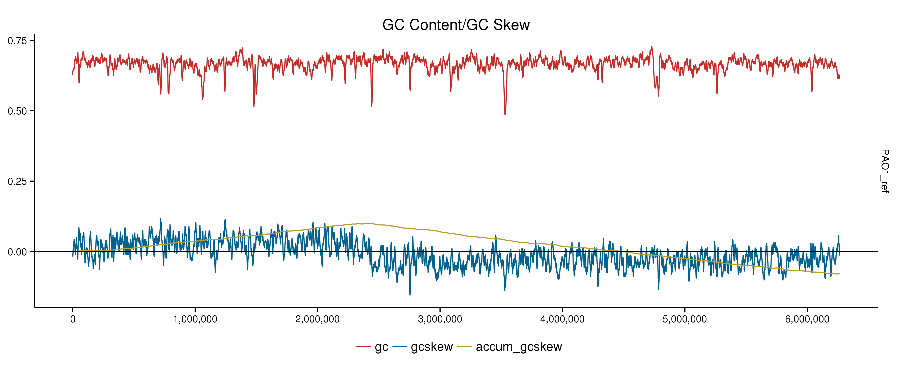

# Manipulation on FASTA/Q format file

## FASTA

### fasta2tab and tab2fasta

[*fasta2tab*](https://github.com/shenwei356/bio_scripts/blob/master/sequence/fasta2tab) 
and [*tab2fasta*](https://github.com/shenwei356/bio_scripts/blob/master/sequence/tab2fasta)
are used in pair. *fasta2tab* transforms the FASTA fromat to two-column table,
fist column is the header and the second is sequence. 
Its could also compute the reverse complement sequence and remove gaps. 
Sequence length and GC content could be outputted as another column, 
which could be used for filtering and sorting. tab2fasta just tranform the
table back to FASTA format. Combining with shell tool like awk and sed,
it’s easy to filter, sort FASTA files. 

#### Examples

##### 1. sort fasta by sequnece length

```
cat seq.fa | fasta2tab -t -l | sort -r -t"`echo -e '\t'`" -n -k3,3 \
| tab2fasta -l 70 > seq.sorted.fa
```

##### 2. extract sub sequence

```
fasta2tab -t -sub 3,10 -rc seq.fa | tab2fasta
```

##### 3. extract sequence longer than 1000 bp

```
cat seq.fa | fasta2tab -t -l | awk -F'\t' '$3 >= 1000' | tab2fasta -l 70
```

##### 4. extract aligned sequence of which the original sequence is longer than 1000 bp

```
cat seq.fa | fasta2tab -l2 | awk -F'\t' '$3 >= 1000' | tab2fasta -l 70
```

##### 5. reverse complement sequence, uppercase, and trim gaps

```
zcat seq.fa.gz | fasta2tab -uc -rc -t | tab2fasta
```

### fasta_extract_by_pattern.pl

[fasta_extract_by_pattern.pl](https://github.com/shenwei356/bio_scripts/blob/master/sequence/fasta_extract_by_pattern.pl) 
could extract FASTA sequences by header or sequence, exactly matching or regular
expression matching are both supported. The query pattern could read from files.
And negation of the result is also easy to get. What's the most important, it could read from STDIN.  

Combining fasta2tab and tab2fasta with [*cvs_grep*](https://github.com/shenwei356/bio_scripts/blob/master/util/csv_grep)
could also have the same function.

#### Examples

##### 1. sequences WITH "bacteria" in header

```
fasta_extract_by_pattern.pl -r -p Bacteria *.fa > result.fa
```

##### 2. sequences WITHOUT “bacteria” in header

```
fasta_extract_by_pattern.pl -r -n -p Bacteria seq1.fa seq2.fa > result.fa
```

##### 3. sequences with TTSAA (AgsI digest site) in SEQUENCE.  Base S stands for C or G.

```
fasta_extract_by_pattern.pl -r -s -p 'TT[C|G]AA' seq.fa > result.fa
```

##### 4. sequences (read from STDIN ) with header that matches any patterns in list file

```
zcat seq.fa.gz | fasta_extract_by_pattern.pl -pf name_list.txt > result.fa
```

### fasta_common_seqs.pl

[fasta_common_seqs.pl](https://github.com/shenwei356/bio_scripts/blob/master/sequence/fasta_common_seqs.pl)
is used to find common sequences in multiple files. It supports comparing by header or sequence. 
By storing the MD5 value of sequences, it has a low memory usage. It’s also could be 
used to remove duplicated records, by finding common sequencing from the
file and its copy or soft link.

### fasta_remove_duplicates.pl

[fasta_remove_duplicates.pl](https://github.com/shenwei356/bio_scripts/blob/master/sequence/fasta_remove_duplicates.pl)
could remove duplicated records from file or STDIN, by both sequence and header.

### fasta_locate_motif.pl

[fasta_locate_motif.pl](https://github.com/shenwei356/bio_scripts/blob/master/sequence/fasta_locate_motif.pl)
could find restrict enzyme recognition site or other motif location.

### fasta_gc_skew.py and fasta_gc_skew.plot.R

Sample out:



## FASTQ

### fastq2tab and tab2fastq

[*fastq2tab*](https://github.com/shenwei356/bio_scripts/blob/master/sequence/fastq2tab) and [*tab2fastq*](https://github.com/shenwei356/bio_scripts/blob/master/sequence/tab2fastq) are similar to fasta2tab and tab2fasta. It could use to filter fastq with help of [*cvs_grep*](https://github.com/shenwei356/bio_scripts/blob/master/util/csv_grep).